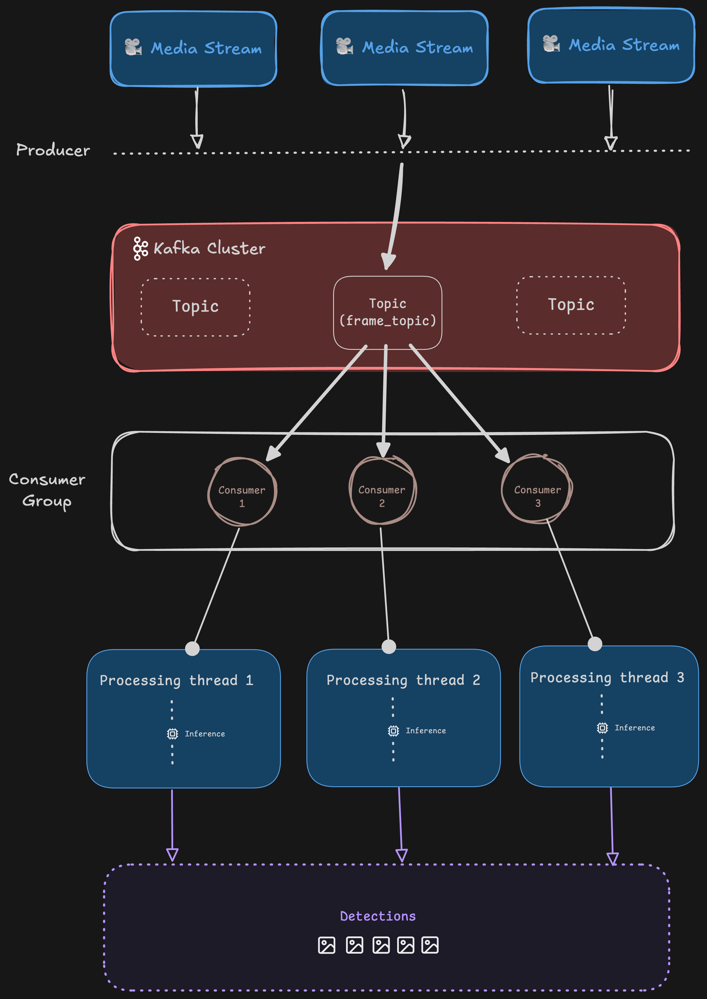

# Distributed Media Inferencing with Kafka

A distributed video processing system that extracts frames from videos, sends them through  Kafka, and performs object detection using YOLO11 in parallel.

- **Frame Extraction**: Extracts frames from MP4 videos with configurable frame skipping
- **Kafka Integration**: Distributed frame processing using Apache Kafka
- **Parallel Inference**: Multi-threaded YOLO11 object detection
- **CLI Interface**: Simple command-line interface for setup and execution

## Architecture



## Prerequisites

- Python 3.13+
- Docker and Docker Compose
- YOLO11 model file (`yolo11n.pt`)

## Installation

1. Clone the repository:
```bash
git clone https://github.com/JayashTripathy/Distributed-Media-Inferencing-With-Kafka.git
cd Distributed-Media-Inferencing-With-Kafka
```

2. Create a virtual environment and install dependencies:
```bash
python -m venv venv
source venv/bin/activate  # On Windows: venv\Scripts\activate
pip install -r requirements.txt
```

## Usage

1. **Start Kafka services**:
```bash
docker-compose up -d
```

2. **Setup Kafka topics**:
```bash
python cli.py setup
```

3. **Produce frames from videos**:
```bash
# Place videos in media/videos_to_process/
python cli.py produce
```

4. **Consume and process frames**:
```bash
python cli.py consume
```

## Project Structure

```
├── cli.py              # CLI interface
├── producer.py         # Kafka producer (extracts frames)
├── consumer.py         # Kafka consumer (runs inference)
├── inference.py        # YOLO inference logic
├── config.py           # Kafka configuration
├── storage.py          # Frame storage utilities
├── docker-compose.yml  # Kafka infrastructure
└── media/
    ├── videos_to_process/    # Input videos
    ├── raw_frames/           # Extracted frames
    └── annotated_frames/     # Processed frames
```

## Configuration

Edit `config.py` to modify:
- Kafka bootstrap servers (default: `localhost:29092`)
- Topic name (default: `frame_topic`)

## License

MIT

